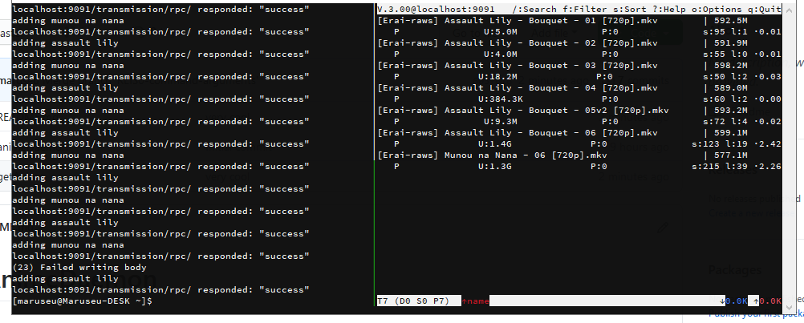

# AnimeDaemon


  /\ comfy shit

## Dependencies:
- Bash
- Transmission-cli

## Installation
Change the website and subber variables in getAnime.
```
website="https://example.si"
subber="Foo-subs"
```
You might need to change the last line of the getAnime script to match your transmission-daemon settings, the script assumes you are using the default configuration.
Copy or move both of them to a folder in PATH.

## Usage
getAnime searches the website's source code for the first magnet link, for example
`getAnime "assault lily 04"`
would get a single episode or
`getAnime "assault lily"`
would get the most recent one

you can also provide a custom resolution in the second argument, the default is 720p
`getAnime "assault lily" "1080p"`
(a resolution is always provided to avoid duplicates)

animeDaemon will run getAnime periodically in 1h intervals, so you can put it in an autorun file, e.g
```
# ~/.bash_profile
if ! pgrep animeDaemon ; then
	nohup animeDaemon "assault lily" &
	nohup animeDaemon "munou na nana" &
fi
```
